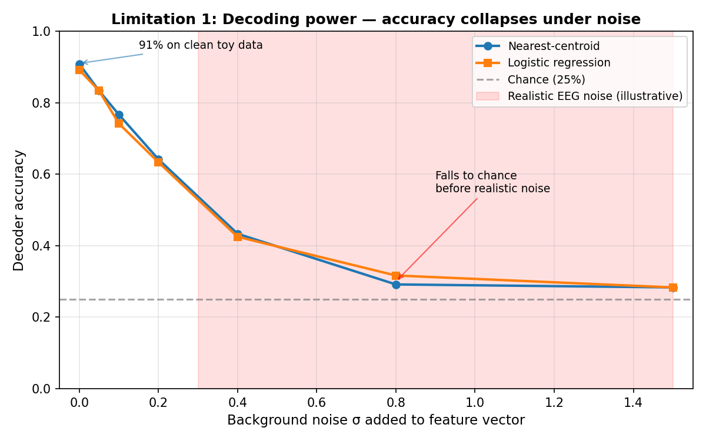
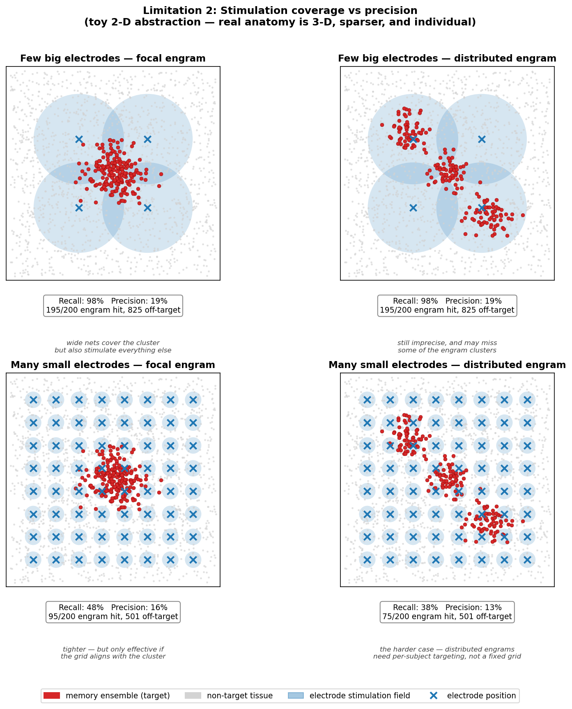
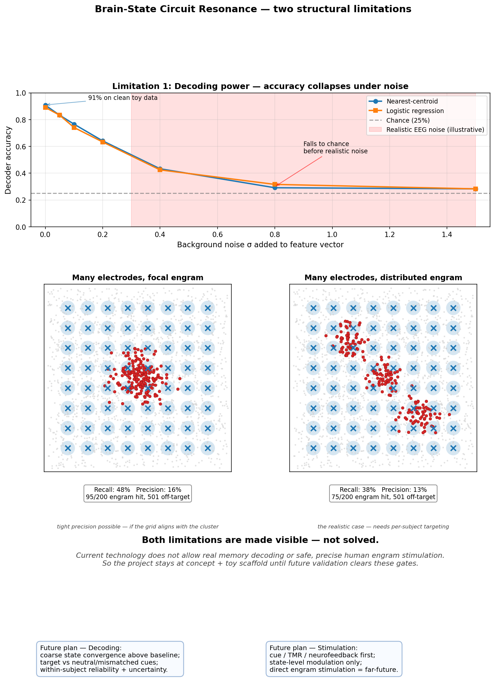

# Known Limitations

After review, the project's faculty advisor flagged two structural limitations
in the current concept. This document records them honestly, what we did to
make each one *visible* in the repo, and what would be required to actually
move past them.

## Limitation 1 — Decoding power: signal vs. noise

> Can the system tell apart the target "happy memory" state from background
> noise and other emotional states, or only the clean toy data?

The existing nearest-centroid baseline reaches ~91% on synthetic samples —
but synthetic samples are nearly noise-free by construction. Real neural
recordings are dominated by background activity, motion artifacts, electrode
drift, and other emotional/cognitive states the subject is also experiencing.

**What we added.** A noise-robustness sweep:
[scripts/evaluate_decoder_noise.py](../scripts/evaluate_decoder_noise.py)
injects Gaussian noise of varying σ into the 6-dim feature vector and
evaluates two classifiers (the existing nearest-centroid plus a scikit-learn
logistic regression as a slightly stronger reference). Results land in
[data/decoder_noise_sweep.csv](../data/decoder_noise_sweep.csv) and are
visualized in [docs/figures/decoder-noise-curve.png](figures/decoder-noise-curve.png).

Representative numbers from a default run (4 classes, chance = 25%):

| σ      | nearest-centroid | logistic-reg |
|--------|-----------------:|-------------:|
| 0.00   |           90.83% |      89.17%  |
| 0.10   |           76.67% |      74.17%  |
| 0.20   |           64.17% |      63.33%  |
| 0.40   |           43.33% |      42.50%  |
| 0.80   |           29.17% |      31.67%  |
| 1.50   |           28.33% |      28.33%  |

Both models collapse to near-chance well before the noise level approaches
what real EEG/iEEG recordings present. The stronger model is not
substantially better — the limitation is the feature space, not the
classifier.

**What's still missing.** Real validation would require, at minimum:
- A real neural dataset (EEG, iEEG, or fMRI) with subjects entering target
  emotional/episodic states under controlled cueing.
- Subject-level cross-validation (train on some subjects, test on others) —
  many published "decoders" overfit when this isn't enforced.
- Distractor states beyond the four toy classes: how does the decoder
  behave when the subject is in a state it has never seen?
- A within-subject test-retest reliability number for the target state.

The repo is honest about this: the synthetic pipeline is a scaffold, not
evidence.

### Future plan for decoding

Current technology does **not** allow this project to decode a real past
memory, a private scene, or an exact integrated self-state. The responsible
next step is narrower: test whether a system can estimate **coarse,
self-reported state dimensions** above baseline under controlled cueing.

A realistic future plan would proceed in stages:

1. **Baseline-first validation.** Compare target cues against neutral and
   mismatched cues, and report whether the model does better than random or
   simple affect labels.
2. **Coarse state targets only.** Predict bounded dimensions such as affect,
   attention, context vividness, body state, self-continuity, meaning, and
   safety — not memory content.
3. **Within-subject reliability.** Ask whether the same person produces a
   repeatable target-state signature across sessions before attempting any
   cross-subject generalization.
4. **Multimodal support.** Treat EEG, physiology, behavior, and self-report as
   partial correlates. None of them should be framed as an engram readout.
5. **Uncertainty display.** Show confidence, null baselines, and failure modes
   instead of a single pseudo-precise “replay score.”

Success would mean evidence for partial state convergence relative to a null
baseline. It would still not mean exact memory replay.

## Limitation 2 — Stimulation: coverage and precision

> Where in the brain does memory live, and can a finite array of electrodes
> cover it densely enough to evoke it without recruiting unrelated neurons?

Memory is stored as a sparse, *distributed* engram across hippocampus, mPFC,
amygdala, and sensory cortex (see
[stimulation-coverage-precision.md](stimulation-coverage-precision.md) for
the full literature map and references). No current human-deployable
modality achieves single-engram precision at whole-brain coverage:

- Optogenetics has cell-type precision but is rodent-only.
- DBS reaches deep targets but stimulates ~mm³ of tissue, not specific cells.
- Surface arrays (ECoG, Neuropixels) get high resolution but only locally.
- Focused ultrasound and TMS reach broad regions non-invasively but coarsely.

**What we added.** A toy 2-D simulation:
[scripts/simulate_stimulation_coverage.py](../scripts/simulate_stimulation_coverage.py)
places a synthetic memory ensemble (one cluster, or three with `--distributed`)
in the unit square, drops K grid electrodes with stimulation radius r, and
sweeps the precision/recall tradeoff. Output:
[data/stimulation_coverage_sweep.csv](../data/stimulation_coverage_sweep.csv)
and [docs/figures/stim-coverage.png](figures/stim-coverage.png).

A more accessible spatial view of the same simulation —
[docs/figures/stim-coverage-spatial.png](figures/stim-coverage-spatial.png) —
shows what coverage actually looks like in the unit square across four
scenarios (focal vs distributed engram, few-big vs many-small electrodes):

What the sweep makes visible: small electrode counts with large radii get
full recall but precision near the chance baseline (most stimulated tissue
is off-target); small radii need either fine alignment or many more
electrodes to hit a distributed ensemble. The same shape would hold in 3-D
with anatomical priors, only worse — the brain is bigger and the engram is
sparser.

**What's still missing.** A serious approach would need:
- A subject-specific localization pipeline (fMRI + intracranial recording)
  to find *this* person's "happy memory" engram, since locations are
  individual.
- Per-electrode cell-type specificity, which currently does not exist for
  humans.
- A way to reactivate a *pattern* of activity across regions in the right
  temporal order, not just drive a single site.

The honest near-term substitute is **cue-driven reactivation** (sensory
triggers leveraging the brain's own retrieval circuits, e.g. sleep-based
Targeted Memory Reactivation) and **state-level neuromodulation** rather than
direct content writing. The project's existing `cue` and `mimo` synthetic
protocols already point this way; this should be the framing the project
leads with.

### Future plan for stimulation

Current technology does **not** allow safe, precise stimulation of a specific
human memory engram. The project should therefore treat direct stimulation as
a far-future research frontier, not as an implemented or near-term capability.

A responsible plan would move from least invasive to most speculative:

1. **Cue-first protocols.** Start with photos, sound, smell, place, narrative,
   and sleep-compatible cues that work through native retrieval circuits.
2. **Targeted Memory Reactivation and neurofeedback.** Explore whether
   non-invasive feedback or sleep cueing can bias broad state dynamics without
   claiming direct content insertion.
3. **State-level modulation only.** If stimulation is considered, frame it as
   coarse regulation of arousal, attention, or affective state — not writing a
   memory back into the brain.
4. **Subject-specific localization.** Any stronger intervention would require
   individualized mapping, invasive validation, temporal pattern control, and
   off-target risk measurement.
5. **Safety gates.** Require reversibility, stop criteria, distress monitoring,
   consent renewal, and a return-to-present endpoint before optimizing any
   resonance effect.

The practical near-term plan is therefore not “stimulate the memory.” It is
“use conservative cues and feedback to test whether partial, safe resonance is
possible while preserving present agency.”

## One-page summary

For a single image that summarizes both limitations and the honest near-term
path, see [docs/figures/limitations-summary.png](figures/limitations-summary.png).

## Honest framing

Both limitations together mean the system, as currently scoped, cannot
"replay" memories in any literal sense — and the project's
[Resonance over Recreation](../README.md) framing is the right one to hold.
The simulations in this repo are pipeline scaffolds and conceptual aids,
not validation. See also
[future-research-directions.md](future-research-directions.md) for how these
limitations connect to the broader open problems.
